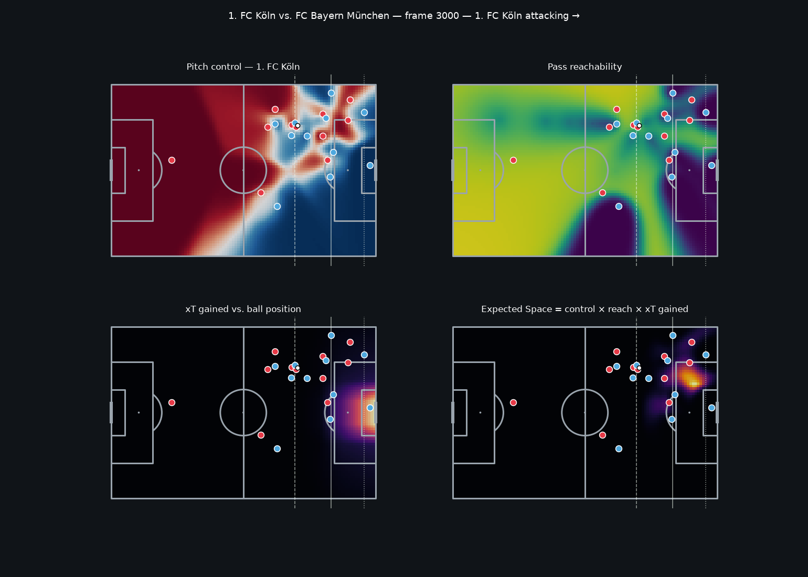

# Xspace — Expected Space

**How much reachable, valuable space does a defence leave open — and how well does the offense exploit it?**

Recent work like [Pressing Intensity](https://arxiv.org/abs/2501.04712) (Bekkers, 2025) measures
defensive pressure from tracking data. Xspace measures the other side of the coin: the space a
defence concedes behind and between its lines, whether the ball can actually get there, what it's
worth, and whether the attacking team takes it.



## The metric

For every cell of the pitch, in every frame, with the team in possession attacking left → right:

```
xSpace(cell) = control(cell) × reach(cell) × xT_gained(cell)
```

| Term | Question it answers | Model |
|---|---|---|
| `control` | Can an attacker get there before a defender? | Physics-based pitch control (Spearman, 2018) |
| `reach` | Can a pass get there without being intercepted? | Time-to-intercept along the passing lane, combined as `1 − ∏(1 − p)` (as in Pressing Intensity) |
| `xT_gained` | Is it worth going there? | Expected Threat (Singh, 2018) relative to the ball's current position |

Each cell is labelled relative to the defensive shape — **behind** the back line, **between** the
lines, **wide** of the block, or **in front** — so space can be profiled by zone.

See [docs/methodology.md](docs/methodology.md) for details, assumptions and the roadmap.

## Outputs (planned)

- **Match ratings** — for every team in every match: xSpace created vs. exploited, conceded by zone
- **Team profiles** — where a defence leaks space, and how quickly an attack finds it
- **Player ratings** — ball carriers (exploitation rate, missed opportunities) and runners
- **Web app** — scrub through matches with live space overlays, plus precomputed dashboards

## Quick start

Requires [uv](https://docs.astral.sh/uv/) and Node 20+.

```bash
uv sync                                              # Python env + dependencies
uv run pytest                                        # tests
uv run python scripts/demo_frame.py --frame 3000     # render docs/img/demo_frame.png
uv run python scripts/export_frame.py --frame 3000   # export a frame for the web app

cd web && npm install && npm run dev                 # http://localhost:5173
```

The first run downloads an open IDSSE match (~2 min) and caches it under `data/processed/`.

## Project layout

```
src/xspace/
  io/        loaders — any kloppy provider → dense numpy arrays
  physics/   kinematics (velocity smoothing), pitch control, pass reachability
  value/     xT surface (swap-in point for our own possession-value model)
  metrics/   Expected Space, defensive lines and zones
  export/    compact JSON for the web app
scripts/     command-line entry points
web/         React + TypeScript + D3 front end
tests/       pytest suite
docs/        methodology and figures
```

## Data

- **[IDSSE](https://doi.org/10.1038/s41597-025-04505-y)** — 7 Bundesliga / 2. Bundesliga matches,
  25 Hz optical tracking + events. Bassek, Rein, Weber et al. (2025), *Scientific Data*. CC BY 4.0.
- **PFF FC 2022 World Cup** (Gradient Sports) — broadcast tracking (29.97 fps) + events for all 64
  matches, free on request. Download with `uv run python scripts/download_pff.py --tracking all`.
  Not redistributed here; see Gradient Sports' terms.

Raw and processed data are never committed.

## References

- Spearman, W. (2018). *Beyond Expected Goals.* MIT Sloan Sports Analytics Conference.
- Shaw, L. *LaurieOnTracking* — reference pitch-control implementation.
- Fernández, J. & Bornn, L. (2018). *Wide Open Spaces.* MIT Sloan Sports Analytics Conference.
- Singh, K. (2018). *Introducing Expected Threat (xT).* karun.in
- Bekkers, J. (2025). *Pressing Intensity: An Intuitive Measure for Pressing in Soccer.* arXiv:2501.04712
- Bassek, M. et al. (2025). *An integrated dataset of spatiotemporal and event data in elite soccer.* Sci Data 12, 195.

## License

Code is MIT-licensed. Data belongs to its respective providers under their own licenses.
